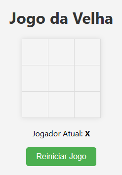

Peço desculpas pela confusão. Vamos ajustar a seção para incorporar a imagem de exemplo (`printscreen.png`). Aqui está a versão revisada:

```markdown
# Jogo da Velha com Flask

Este é um simples jogo da velha implementado em Python usando o framework Flask para criar uma aplicação web. Os jogadores podem se divertir jogando alternadamente em um ambiente amigável.



## Como Usar

### Pré-requisitos
- Python instalado
- Pip (gerenciador de pacotes do Python)

### Passos para Executar
1. Clone o repositório:
   ```bash
   git clone https://github.com/seu-usuario/seu-repositorio.git
   cd seu-repositorio
   ```

2. Instale as dependências:
   ```bash
   pip install -r requirements.txt
   ```

3. Execute o aplicativo:
   ```bash
   python app.py
   ```

4. Abra o navegador e visite [http://localhost:5000](http://localhost:5000).

### Acesso Externo
Se desejar acessar de um dispositivo externo, certifique-se de estar na mesma rede Wi-Fi e execute:
   ```bash
   python app.py --host=0.0.0.0
   ```

Abra o navegador e visite `<seu-endereco-ip>:5000`. Encontre seu endereço IP usando `ipconfig` no Windows ou `ifconfig` no Linux/Mac.

---

Certifique-se de substituir `seu-usuario` e `seu-repositorio` pelos seus dados reais. Use a captura de tela real do jogo, que deve estar na pasta `img`, no lugar da imagem de exemplo `printscreen.png`.
